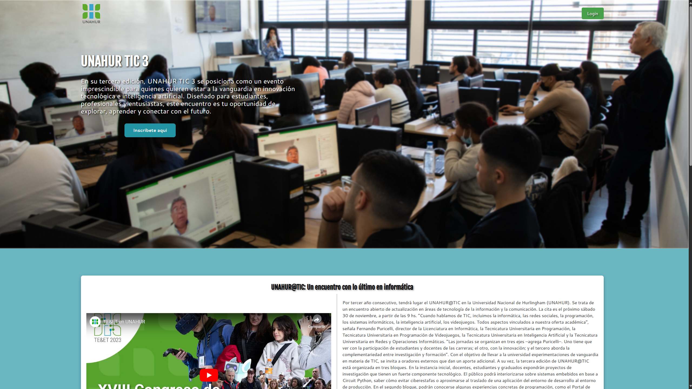
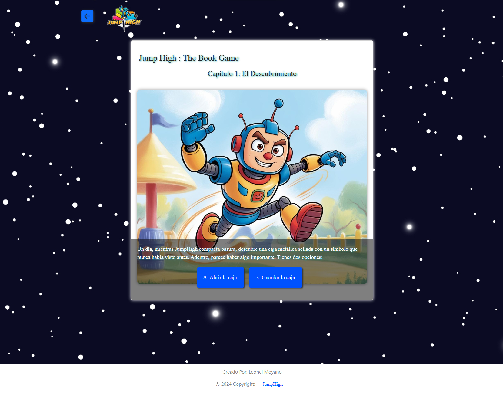

# ¡Hola, soy Leonel Moyano! ✨

## 👨🏻‍💻 Sobre Mí  
**Estudiante de Programación y Desarrollador Web Freelancer**

💡 Apasionado por la tecnología, el desarrollo web y la creación de soluciones prácticas para diversos proyectos.  
🎓 Programador web **freelancer**, especializado en tecnologías modernas para frontend y backend.  
💬 No dudes en contactarme para proyectos freelance, colaboraciones o simplemente para hablar sobre tecnología.  

---

## 👨🏻‍💻 Algunos Proyectos

  <!-- Card 1 -->
  

    
    
Texto 1: Descripción breve del librojuego.

  

  <!-- Card 2 -->
  

    
    
Texto 2: Más información sobre la experiencia interactiva.

  

  <!-- Card 3 -->
  

    
    
Texto 3: Historia y narrativa del libro interactivo.

  

  <!-- Card 4 -->
  

    
    
Texto 4: Descripción de las funcionalidades interactivas.

  

---

## 📫 Contacto  

- **Correo electrónico:** [leonelmoyano56@gmail.com](mailto:leonelmoyano56@gmail.com)  
- **GitHub:** [https://github.com/LeonelMoyanoCode](https://github.com/LeonelMoyanoCode)  
- **LinkedIn:** [https://www.linkedin.com/in/leonel-moyano1/](https://www.linkedin.com/in/leonel-moyano1/)  
